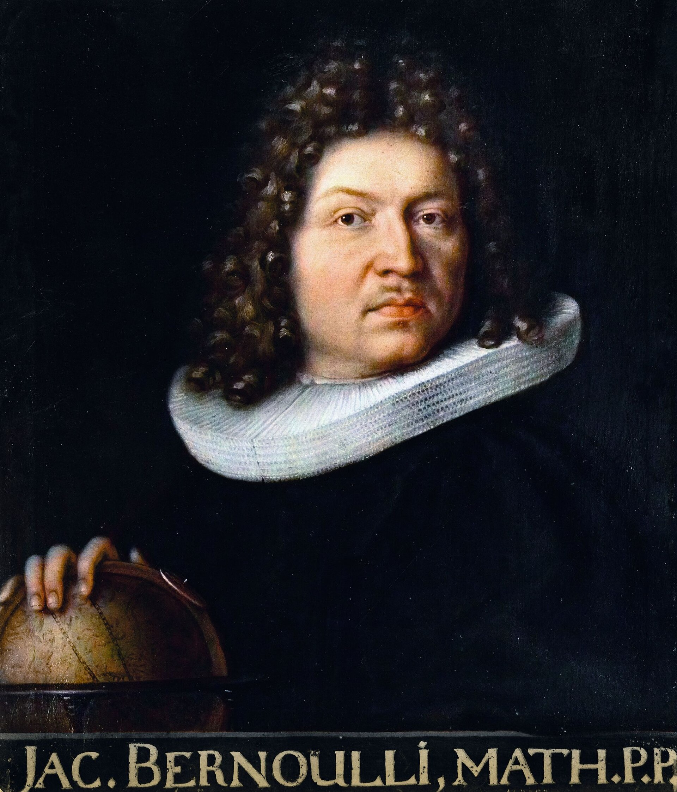

# Introduction

The history of calculus is often associated with Isaac Newton and Gottfried Wilhelm Leibniz, who independently developed the fundamental ideas of differential and integral calculus during the seventeenth century. However, the growth of calculus into a powerful mathematical discipline was largely driven by later mathematicians who expanded, applied, and refined these ideas. Among these contributors, no family had a greater influence than the Bernoulli family.

Originating from Basel, Switzerland, the Bernoullis produced several generations of mathematicians whose work transformed calculus from a new mathematical technique into an essential tool for science and engineering. Their contributions ranged from differential equations and infinite series to probability theory and mathematical physics. The family's influence extended for more than a century and played a crucial role in establishing many areas of modern mathematics.

# Origins of the Bernoulli Family

The Bernoulli family was originally of Flemish origin. Due to religious persecution, they migrated to Frankfurt and later settled in Basel, Switzerland. Although many family members entered business and public service, several became distinguished mathematicians.

The most influential members of the mathematical branch of the family were:

* Jacob Bernoulli (1654–1705)
* Johann Bernoulli (1667–1748)
* Daniel Bernoulli (1700–1782)
* Nicolaus Bernoulli I (1687–1759)
* Nicolaus Bernoulli II (1695–1726)

Together, they established one of the most productive mathematical dynasties in history.

The following is their Family tree of the Basler Bernoullis:

# The Bernoulli Family Tree of Mathematicians
This includes the family members who made significant contributions to mathematics. You can click the box of the name to access the story of the mathematician if he's mentioned below. The full famlity tree is given at the end of the website.
```{mermaid}
graph TD

N["Niklaus Bernoulli (1623–1708)"]

N --> J1["Jakob I Bernoulli (1654–1705)"]
N --> N0["Nikolaus Bernoulli (1662–1716)"]
N --> J2["Johann I Bernoulli (1667–1748)"]
N --> H0["Hieronymus Bernoulli (1669–1760)"]

N0 --> NI["Nikolaus I Bernoulli (1687–1759)"]

J2 --> NII["Nikolaus II Bernoulli (1695–1726)"]
J2 --> D["Daniel Bernoulli (1700–1782)"]
J2 --> JII["Johann II Bernoulli (1710–1790)"]

JII --> JIII["Johann III Bernoulli (1744–1807)"]
JII --> DII["Daniel II Bernoulli (1751–1834)"]
JII --> NIII["Nikolaus III Bernoulli (1754–1841)"]
JII --> JAC2["Jakob II Bernoulli (1759–1789)"]

click J1 "#jacob-bernoulli-1654-1705" "Jacob Bernoulli"
click J2 "#johann-bernoulli-1667-1748" "Johann Bernoulli"
click NI "#nicolaus-i-bernoulli-1687-1759" "Nicolaus I Bernoulli"
click D "#daniel-bernoulli-1700-1782" "Daniel Bernoulli"
```
 
<a id="jacob-bernoulli-1654-1705"></a>

# Jacob Bernoulli (1654–1705): Pioneer of Calculus and Probability

{ width=180px alt="Jacob Bernoulli" fig-align="center" }

## Early Life

Jacob Bernoulli was initially expected to study theology, following his family's wishes. However, he secretly pursued mathematics and astronomy. After learning the newly developed calculus of Leibniz, he quickly became one of its leading advocates.

## Contributions to Calculus

Jacob was among the first mathematicians to understand the potential of Leibniz's methods. He applied calculus to solve problems involving curves, motion, and geometry.

One of his most famous achievements was his study of the logarithmic spiral, a curve that fascinated him because it preserved its shape under scaling. He admired the curve so much that he requested it be engraved on his tombstone.

Jacob also contributed significantly to the theory of infinite series and differential equations. His investigations helped demonstrate the power of calculus for solving complex mathematical problems.

## Birth of Probability Theory

Jacob's posthumously published book *Ars Conjectandi* (1713) became a foundational text in probability theory. In this work, he established what is now known as the Law of Large Numbers, showing that the observed frequency of an event approaches its theoretical probability as the number of trials increases.

This result laid the foundation for modern statistics and probabilistic reasoning.

<a id="johann-bernoulli-1667-1748"></a>

# Johann Bernoulli (1667–1748): The Great Teacher of Calculus

{ width=180px alt="Johann Bernoulli" fig-align="center" }

## Rival and Successor

Johann Bernoulli, Jacob's younger brother, learned mathematics largely from Jacob. He soon became a brilliant mathematician in his own right. Their relationship, however, became increasingly competitive, leading to famous disputes over priority and recognition.

## Promotion of Leibnizian Calculus

Johann played a major role in spreading Leibniz's notation and methods throughout Europe. His lectures and publications helped establish the notation still used today, including symbols such as:

* $\int$ for integration
* $d$ for differentiation

Through his teaching, Johann influenced an entire generation of mathematicians.

## The Brachistochrone Problem

In 1696 Johann proposed the famous Brachistochrone Problem:

> Given two points at different heights, what path allows a particle to travel between them in the shortest time under gravity?

The challenge attracted solutions from leading mathematicians across Europe, including Newton and Leibniz.

The solution was a cycloid, not a straight line. This problem became one of the earliest and most important applications of calculus of variations, a field that later influenced mechanics, physics, and optimization theory.

## Mentor to Euler

Perhaps Johann's greatest legacy was teaching the young Leonhard Euler. Under Johann's guidance, Euler developed into one of the greatest mathematicians in history and further expanded many ideas originating from the Bernoulli family.

<a id="nicolaus-i-bernoulli-1687-1759"></a>

# Nicolaus I Bernoulli (1687–1759): Extending the Family Legacy

.jpeg){ width=160px alt="Nicolaus Bernoulli (image file labelled II)" fig-align="center" }

Although overshadowed by his famous relatives, Nicolaus I Bernoulli played an important role in the development of probability theory and mathematical analysis. The son of Nikolaus Bernoulli and nephew of Jacob and Johann Bernoulli, he continued the family's tradition of mathematical scholarship.

Nicolaus studied law and mathematics at the University of Basel. His work focused largely on probability, finance, and the application of mathematics to practical problems. He contributed to the early development of mathematical economics and corresponded with many of the leading scholars of his time.

One of his most famous contributions was his discussion of what later became known as the **St. Petersburg Paradox**, a probability problem involving a lottery with an infinite expected value. The paradox challenged traditional interpretations of expected gain and influenced later developments in probability theory and economics. Daniel Bernoulli would later provide a famous resolution to the paradox through the concept of expected utility.

Although Nicolaus I did not make discoveries as revolutionary as Jacob or Johann, his work helped maintain the Bernoulli family's influence in European mathematics during the eighteenth century.

<a id="daniel-bernoulli-1700-1782"></a>

# Daniel Bernoulli (1700–1782): Mathematics Meets Physics

{ width=180px alt="Daniel Bernoulli" fig-align="center" }

## Early Life

Daniel Bernoulli was Johann's son and one of the most talented members of the family. Although trained in medicine, his passion remained mathematics and natural philosophy.

## Bernoulli's Principle

Daniel is best known for his work in fluid dynamics. In his book *Hydrodynamica* (1738), he established what is now called Bernoulli's Principle:

> As the speed of a fluid increases, its pressure decreases.

This principle explains many physical phenomena, including the lift generated by airplane wings and the operation of various engineering devices.

## Differential Equations and Mathematical Physics

Daniel extensively used calculus to model physical systems. His work helped demonstrate how differential equations could describe real-world phenomena such as fluid flow, vibration, and motion.

This represented an important shift in mathematics: calculus was no longer merely a tool for solving abstract problems but became a language for understanding nature itself.

## Contributions to Probability

Daniel also studied probability and economics. His analysis of decision-making under uncertainty led to the concept of expected utility, which remains influential in economics and behavioral science today.


<a id="leonhard-euler-1707-1783"></a>

# The Bernoulli Family and Leonhard Euler

.jpg){ width=180px alt="Leonhard Euler" fig-align="center" }

One of the greatest contributions of the Bernoulli family was their influence on Leonhard Euler (1707–1783), who is widely regarded as one of the greatest mathematicians in history.

Euler's father was a close friend of Johann Bernoulli, and Johann quickly recognized the young Euler's exceptional talent. Although Euler initially studied theology, Johann encouraged him to pursue mathematics. Through regular meetings and private instruction, Johann introduced Euler to the latest developments in calculus and mathematical analysis.

Euler later expanded many of the ideas pioneered by the Bernoullis. He developed new methods for solving differential equations, advanced the calculus of variations, and established many of the foundations of modern analysis. In a sense, the Bernoulli family served as a bridge between the invention of calculus by Newton and Leibniz and its later systematic development by Euler.

The relationship between the Bernoullis and Euler demonstrates how mathematical knowledge is often transmitted through mentorship and collaboration across generations.


# The Basel Problem: A Famous Challenge in Analysis

The city of Basel gave its name to one of the most celebrated problems in the history of mathematics: the Basel Problem.

The problem asks for the exact value of the infinite series

$$
\sum_{n=1}^{\infty}\frac{1}{n^2}
$$

which begins as

$$
1+\frac14+\frac19+\frac1{16}+\cdots.
$$

Jacob Bernoulli first studied this series, and both he and Johann attempted unsuccessfully to determine its exact sum. The problem remained unsolved for several decades and became one of the most famous challenges in mathematics.

In 1734, Leonhard Euler astonished the mathematical community by proving that

$$
\sum_{n=1}^{\infty}\frac{1}{n^2}
= \frac{\pi^2}{6}.
$$

This remarkable result connected an infinite series of rational numbers with the geometric constant $\pi$. Euler's solution relied heavily on techniques that had emerged from the Bernoulli tradition of studying infinite series and analysis.

Today, the Basel Problem is regarded as a milestone in the development of mathematical analysis and illustrates the important role that the Bernoulli family played in advancing the study of infinite series.

# The Bernoulli Numbers

One of the family's most enduring mathematical legacies is the sequence known as the Bernoulli Numbers.

These numbers first appeared in Jacob Bernoulli's investigation of sums of powers:

$$
1^k + 2^k + \cdots + n^k.
$$

Bernoulli discovered formulas that expressed these sums in a systematic way, introducing numbers that now bear his name.

Today, Bernoulli numbers appear in:

* Number theory
* Infinite series
* Numerical analysis
* The Euler–Maclaurin formula
* The Riemann zeta function

Their continued importance demonstrates the lasting impact of Bernoulli's work on modern mathematics.

# Family Rivalries and Competition

The Bernoulli family was famous not only for its mathematical achievements but also for its intense rivalries.

Jacob and Johann frequently argued over priority for discoveries. After Jacob's death, Johann continued many of the disputes publicly.

Later, Johann became jealous of the success of his son Daniel. When Daniel won a scientific prize jointly with him, Johann reportedly became so upset that he refused to speak to his son for some time.

These conflicts reveal the highly competitive environment in which mathematical discoveries were made during the eighteenth century.

# Influence on Modern Calculus

The Bernoulli family helped transform calculus from a new invention into a mature mathematical discipline.

Their contributions include:

* Development of differential equations
* Applications of calculus to mechanics
* Foundations of probability theory
* Creation of the calculus of variations
* Advancement of infinite series
* Promotion of Leibnizian notation
* Mathematical modeling of physical phenomena

Many concepts studied in modern calculus courses trace their origins directly to the work of the Bernoullis.

# Conclusion

The Bernoulli family occupies a unique place in the history of mathematics. Across three generations, they produced pioneering research that shaped calculus, probability, differential equations, and mathematical physics. Jacob Bernoulli advanced the foundations of probability and series, Johann Bernoulli spread and expanded calculus throughout Europe, and Daniel Bernoulli demonstrated the power of mathematics in understanding the physical world.

Their collective achievements influenced mathematicians such as Euler and contributed significantly to the development of modern science. More than three centuries later, concepts bearing the Bernoulli name remain central to mathematics, engineering, economics, and physics. The story of the Bernoulli family is therefore not merely a family history but an important chapter in the evolution of calculus itself.

# The full Bernoulli Family Tree
```{mermaid}
graph LR

N["Niklaus Bernoulli (1623–1708)"]

N --> J1["Jakob I (1655–1705)"]
N --> N1["Nikolaus (1662–1716)"]
N --> Jo1["Johann I (1667–1748)"]
N --> H1["Hieronymus (1669–1760)"]

N1 --> NI["Nikolaus I (1687–1759)"]

Jo1 --> NII["Nikolaus II (1695–1726)"]
Jo1 --> D1["Daniel (1700–1782)"]
Jo1 --> J2["Johann II (1710–1790)"]

H1 --> F1["Franz (1705–1777)"]

J2 --> J3["Johann III (1744–1807)"]
J2 --> D2["Daniel II (1751–1834)"]
J2 --> N3["Nikolaus III (1754–1841)"]
J2 --> Ja2["Jakob II (1759–1789)"]

F1 --> H2["Hieronymus (1735–1786)"]

J3 --> C1["Christoph (1782–1863)"]
J3 --> Jos["Johannes (1785–1869)"]

D2 --> Leo1["Leonhard (1786–1852)"]
D2 --> L2["Leonhard (1791–1871)"]

N3 --> N4["Nikolaus (1793–1876)"]

H2 --> JJ1["Johann Jacob (1769–1853)"]

C1 --> Car1["Carl Christoph (1809–1884)"]

Jos --> Kar1["Carl Johann (1835–1906)"]

Leo1 --> Edu1["Eduard (1819–1899)"]

L2 --> Aug1["August (1839–1921)"]
L2 --> Fritz["Fritz (1824–1913)"]

N4 --> Theo["Theodor (1837–1909)"]

JJ1 --> JJ2["Johann Jacob (1802–1892)"]
JJ1 --> Franz2["Franz (1813–1850)"]

Car1 --> CaC["Carl Christoph (1861–1923)"]

Kar1 --> CaA["Carl Albrecht (1868–1937)"]

Edu1 --> Edu2["Eduard (1867–1927)"]

Aug1 --> AL["August Leonhard (1879–1939)"]
Aug1 --> Maria["Maria (1868–1963)"]

Theo --> Rud["Rudolf (1880–1948)"]

JJ2 --> JJ3["Johann Jakob (1831–1913)"]
JJ2 --> CaG["Carl Gustav (1834–1878)"]
JJ2 --> Ernst["Ernst (1846–1931)"]

Franz2 --> Eli["Elisabeth (1873–1935)"]
Franz2 --> Hans["Hans (1876–1959)"]

CaC --> Christoph["Christoph (1897–1981)"]
CaA --> Eva["Eva (1903–1995)"]
JJ3 --> Lucas["Lucas (1907–1976)"]
Ernst --> Eugen["Eugen (1882–1983)"]

Lucas --> Cornelia["Cornelia Bernoulli (b. 1954)"]

click J1 "#jacob-bernoulli-1654-1705" "Jacob Bernoulli"
click Jo1 "#johann-bernoulli-1667-1748" "Johann Bernoulli"
click NI "#nicolaus-i-bernoulli-1687-1759" "Nicolaus I Bernoulli"
click D1 "#daniel-bernoulli-1700-1782" "Daniel Bernoulli"
```