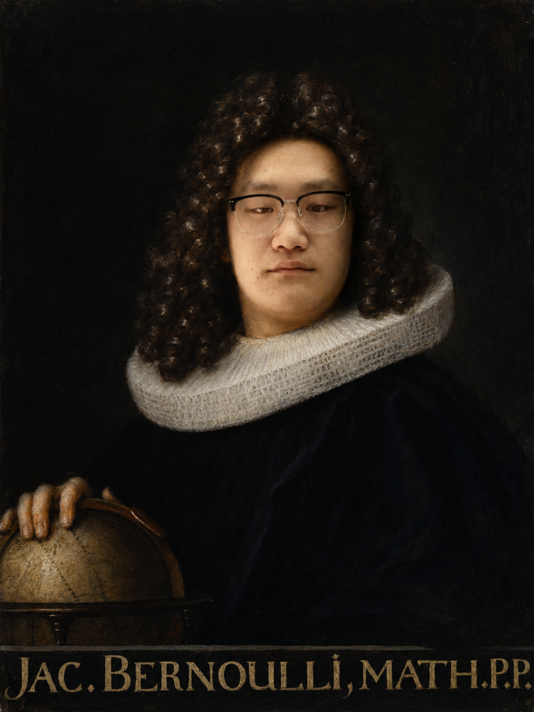
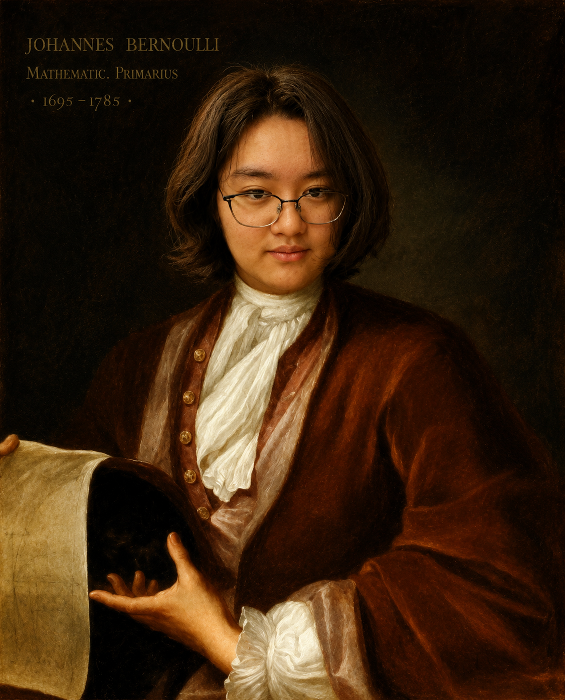
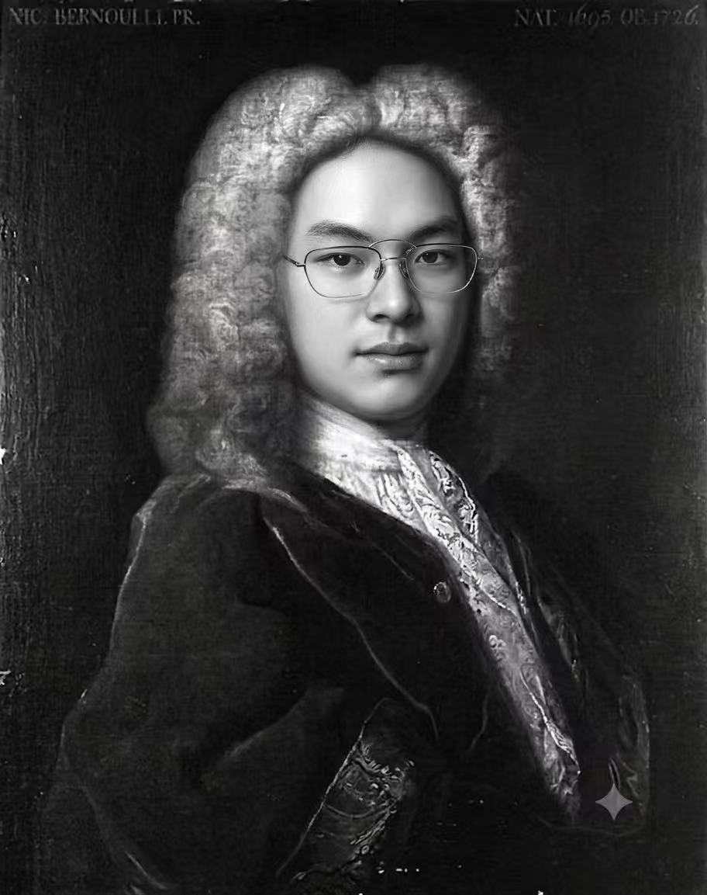
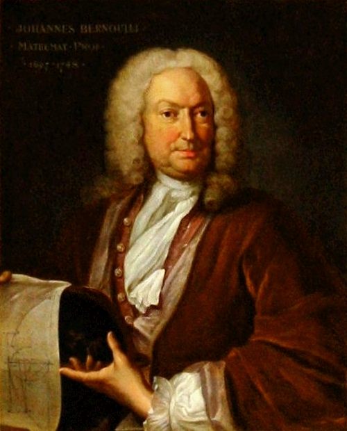
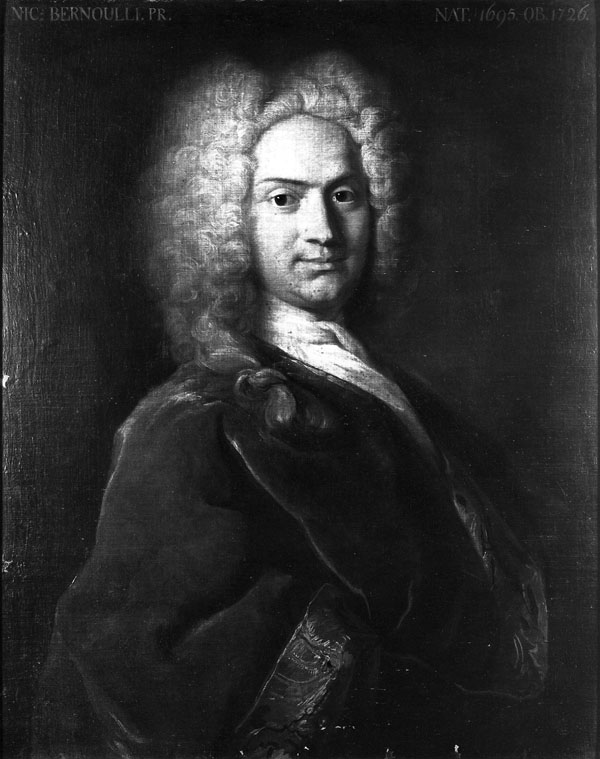
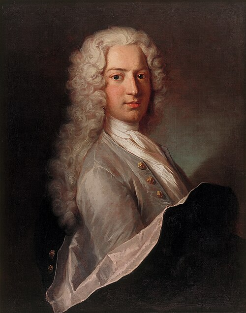
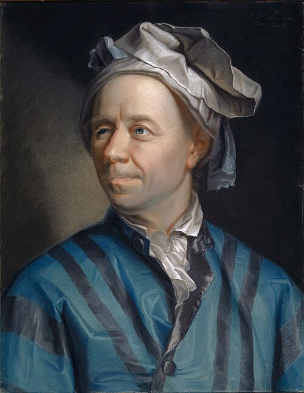

::: {.callout-note}
## Group Information

**Group:** Still Thinking

**Authors:**

- Zhang Yang MAT2509036
- Zhu Xinbo MAT2509040
- Zhang Qixuan MAT2509034

<div style="display: flex; justify-content: center; gap: 1rem; flex-wrap: wrap; margin-top: 1rem;">
{width="210" fig-alt="Portrait associated with group member Zhang Yang"}
{width="210" fig-alt="Portrait associated with group member Zhu Xinbo"}
{width="210" fig-alt="Portrait associated with group member Zhang Qixuan"}
</div>

:::

# Introduction

When people tell the story of calculus, the spotlight usually lands on Isaac Newton and Gottfried Wilhelm Leibniz. Fair enough: they created the first big versions of differential and integral calculus. But if calculus were a new machine, Newton and Leibniz built the prototype. The Bernoulli family helped turn it into a machine that other mathematicians could actually use, repair, argue over, and attach to physics.

The Bernoullis were a Swiss family from Basel whose mathematical branch produced several major figures across multiple generations. Their work touched differential equations, infinite series, probability, mechanics, fluid dynamics, and the calculus of variations. In other words, they were not just "a family with a few smart people." They were almost a small research institute, except with more dinner-table tension.

This story focuses on four central members:

- **Jacob Bernoulli**: early master of Leibnizian calculus, probability, infinite series, and Bernoulli numbers.
- **Johann Bernoulli**: energetic promoter of calculus, famous teacher, and a key figure in the brachistochrone problem.
- **Nicolaus I Bernoulli**: important contributor to probability and the St. Petersburg paradox.
- **Daniel Bernoulli**: bridge between calculus, probability, economics, and fluid mechanics.

## Origins of the Bernoulli Family

The Bernoulli family was originally of Flemish origin. Because of religious persecution, the family migrated to Frankfurt and later settled in Basel, Switzerland. Although many family members entered business, law, medicine, and public service, several became distinguished mathematicians.

The most influential members of the mathematical branch of the family were:

- Jacob Bernoulli (1655-1705)
- Johann Bernoulli (1667-1748)
- Daniel Bernoulli (1700-1782)
- Nicolaus I Bernoulli (1687-1759)
- Nicolaus II Bernoulli (1695-1726)

Together, they established one of the most productive mathematical dynasties in history.

# The Bernoulli Family Tree of Mathematicians

The mathematical Bernoullis can be confusing because the same names repeat like variables in a badly labelled proof. Here is the simplified tree for the main people in this story. Clickable boxes jump to the related section.

```{mermaid}
graph TD

N["Niklaus Bernoulli (1623-1708)"]

N --> J1["Jacob I Bernoulli (1655-1705)"]
N --> N0["Nicolaus Bernoulli (1662-1716)"]
N --> J2["Johann I Bernoulli (1667-1748)"]
N --> H0["Hieronymus Bernoulli (1669-1760)"]

N0 --> NI["Nicolaus I Bernoulli (1687-1759)"]

J2 --> NII["Nicolaus II Bernoulli (1695-1726)"]
J2 --> D["Daniel Bernoulli (1700-1782)"]
J2 --> JII["Johann II Bernoulli (1710-1790)"]

JII --> JIII["Johann III Bernoulli (1744-1807)"]
JII --> DII["Daniel II Bernoulli (1751-1834)"]
JII --> NIII["Nicolaus III Bernoulli (1754-1841)"]
JII --> JAC2["Jacob II Bernoulli (1759-1789)"]

click J1 "#jacob-bernoulli-1655-1705" "Jacob Bernoulli"
click J2 "#johann-bernoulli-1667-1748" "Johann Bernoulli"
click NI "#nicolaus-i-bernoulli-1687-1759" "Nicolaus I Bernoulli"
click D "#daniel-bernoulli-1700-1782" "Daniel Bernoulli"
```

<a id="jacob-bernoulli-1655-1705"></a>

# Jacob Bernoulli (1655-1705): Pioneer of Calculus and Probability

<div style="text-align: center;">
{width="230" fig-alt="Portrait of Jacob Bernoulli"}
</div>

## Early Life

Jacob Bernoulli was pushed toward philosophy and theology by his family, but he studied mathematics and astronomy anyway. This is a very Bernoulli move: the family often wanted respectable careers, and the mathematically talented members kept wandering toward calculus like iron filings toward a magnet.

## Contributions to Calculus

Jacob became one of the first mathematicians to seriously understand and use Leibniz's calculus. This mattered because Leibniz's original papers were powerful but not exactly beginner-friendly. Jacob and Johann were among the people who translated the new notation into actual problem-solving.

One place Jacob appears directly in calculus courses is the **Bernoulli differential equation**:

$$
y' + P(x)y = Q(x)y^n.
$$

For $n \neq 0,1$, the clever substitution

$$
v = y^{1-n}
$$

turns it into a linear differential equation. This is a perfect example of what the Bernoullis were good at: taking a messy-looking problem and finding the change of viewpoint that makes it solvable.

## Birth of Probability Theory

Jacob also worked on infinite series, the logarithmic spiral, and probability. His book *Ars Conjectandi*, published after his death in 1713, became one of the founding texts of probability theory. It contains an early form of the **Law of Large Numbers**, the idea that repeated trials settle down toward a stable probability in the long run.

## The Bernoulli Numbers

One of Jacob's most lasting legacies is the sequence now called the **Bernoulli numbers**. They appear in formulas for sums of powers:

$$
1^k + 2^k + 3^k + \cdots + n^k.
$$

For example,

$$
1 + 2 + \cdots + n = \frac{n(n+1)}{2},
$$

and

$$
1^2 + 2^2 + \cdots + n^2 = \frac{n(n+1)(2n+1)}{6}.
$$

For higher powers, the formulas become more complicated, and Bernoulli numbers help organize them. They later appeared all over analysis, including in the Euler-Maclaurin formula and the study of the Riemann zeta function. That is the strange life of mathematical ideas: Jacob was studying sums of powers, and centuries later his numbers still show up in advanced analysis.

<a id="johann-bernoulli-1667-1748"></a>

# Johann Bernoulli (1667-1748): The Great Teacher of Calculus

<div style="text-align: center;">
{width="230" fig-alt="Portrait of Johann Bernoulli"}
</div>

## Rival and Successor

Johann Bernoulli was Jacob's younger brother. He first studied medicine, but Jacob taught him mathematics, and soon Johann became one of the strongest mathematicians in Europe. Their relationship then turned from teacher-student into rivalry. This is the part of the story where mathematics starts to feel less like quiet chalkboards and more like a competitive sport.

## Promotion of Leibnizian Calculus

Johann's biggest historical role was spreading Leibnizian calculus. He taught, published, argued, and promoted the new methods across Europe. Through him, calculus became less of a secret technique and more of a working language.

## The Brachistochrone Problem

His most famous challenge was the **brachistochrone problem**:

> Given two points at different heights, what curve lets a particle slide from the upper point to the lower point in the shortest time under gravity?

The tempting answer is "a straight line," but the correct answer is a **cycloid**. This problem helped launch the calculus of variations, where instead of optimizing a number, we optimize an entire curve.

That shift is important. Ordinary calculus asks questions like:

$$
\text{Which } x \text{ minimizes } f(x)?
$$

The calculus of variations asks something bigger:

$$
\text{Which function or path minimizes a whole quantity?}
$$

This idea later became central in mechanics, optics, optimization, and physics.

<a id="nicolaus-i-bernoulli-1687-1759"></a>

# Nicolaus I Bernoulli (1687-1759): Extending the Family Legacy

<div style="text-align: center;">
{width="210" fig-alt="Portrait associated with Nicolaus Bernoulli"}
</div>

Nicolaus I Bernoulli was the nephew of Jacob and Johann. He studied law and mathematics, and much of his important work appeared through correspondence. His name is strongly connected with the **St. Petersburg paradox**, one of the best historical examples of probability refusing to behave politely.

The simplified game is this:

1. Flip a fair coin until the first head appears.
2. If the first head appears on toss $k$, the payoff is $2^k$.
3. The expected value is

$$
\frac12(2)+\frac14(4)+\frac18(8)+\cdots
=1+1+1+\cdots = \infty.
$$

So the expected monetary value is infinite. But almost nobody would pay an enormous amount of money to play once. The paradox asks: if the expected value is infinite, why does the game not feel infinitely valuable?

That question pushed mathematicians to think harder about risk, utility, and human decision-making. It also set up Daniel Bernoulli's famous response.

<a id="daniel-bernoulli-1700-1782"></a>

# Daniel Bernoulli (1700-1782): Mathematics Meets Physics

<div style="text-align: center;">
{width="230" fig-alt="Portrait of Daniel Bernoulli"}
</div>

## Early Life

Daniel Bernoulli was Johann's son. He trained in medicine but became deeply involved in mathematics and natural philosophy. His most famous work is *Hydrodynamica* (1738), where he studied fluid motion using mathematical reasoning.

## Bernoulli's Principle

The result most students recognize is **Bernoulli's principle**:

> When the speed of a moving fluid increases, its pressure tends to decrease.

In a simplified steady-flow form, this appears as

$$
P+\frac12\rho v^2+\rho gh=\text{constant},
$$

where $P$ is pressure, $\rho$ is density, $v$ is speed, $g$ is gravitational acceleration, and $h$ is height.

## Differential Equations and Mathematical Physics

This is calculus becoming physics. Instead of treating derivatives and integrals as symbolic exercises, Daniel used mathematical relationships to describe real motion. That spirit is everywhere in modern applied mathematics.

## Contributions to Probability

Daniel also gave a famous way to think about the St. Petersburg paradox. His key idea was that people do not value money linearly. Winning an extra dollar matters a lot when you have little money, but it matters much less when you are already rich.

In modern language, Daniel was thinking in terms of **expected utility** rather than expected money. A common model is logarithmic utility:

$$
U(w)=\ln(w).
$$

The point is not that this exact formula always describes real people. The point is that value depends on context. This idea became important in economics, finance, decision theory, and statistics.

# The Bernoulli Family and Leonhard Euler

<a id="leonhard-euler-1707-1783"></a>

<div style="text-align: center;">
{width="230" fig-alt="Portrait of Leonhard Euler"}
</div>

One of the greatest contributions of the Bernoulli family was their influence on Leonhard Euler (1707-1783), who is widely regarded as one of the greatest mathematicians in history.

Euler's father was a close friend of Johann Bernoulli, and Johann quickly recognized the young Euler's exceptional talent. Although Euler initially studied theology, Johann encouraged him to pursue mathematics. Through regular meetings and private instruction, Johann introduced Euler to the latest developments in calculus and mathematical analysis.

Euler later expanded many of the ideas pioneered by the Bernoullis. He developed new methods for solving differential equations, advanced the calculus of variations, and established many foundations of modern analysis. In a sense, the Bernoulli family served as a bridge between the invention of calculus by Newton and Leibniz and its later systematic development by Euler.

# The Basel Problem: A Famous Challenge in Analysis

The city of Basel gave its name to one of the most celebrated problems in the history of mathematics: the Basel Problem.

The problem asks for the exact value of the infinite series

$$
\sum_{n=1}^{\infty}\frac{1}{n^2}
= 1+\frac14+\frac19+\frac1{16}+\cdots .
$$

Jacob Bernoulli first studied this series, and both he and Johann attempted unsuccessfully to determine its exact sum. The problem remained unsolved for several decades and became one of the most famous challenges in mathematics.

In 1734, Leonhard Euler astonished the mathematical community by proving that

$$
\sum_{n=1}^{\infty}\frac{1}{n^2}=\frac{\pi^2}{6}.
$$

This remarkable result connected an infinite series of rational numbers with the geometric constant $\pi$. Euler's solution relied heavily on techniques that had emerged from the Bernoulli tradition of studying infinite series and analysis.

## Interactive: Watch the Basel Sum Approach $\pi^2/6$

Move the slider to see the partial sum

$$
S_N=\sum_{n=1}^{N}\frac{1}{n^2}
$$

creep toward Euler's value.

```{ojs}
//| echo: false
viewof baselTerms = Inputs.range([1, 500], {
  value: 20,
  step: 1,
  label: "Number of terms"
})

baselTarget = Math.PI ** 2 / 6

baselPartialSum = Array.from(
  { length: baselTerms },
  (_, index) => 1 / ((index + 1) ** 2)
).reduce((total, term) => total + term, 0)

baselError = Math.abs(baselTarget - baselPartialSum)

html`
  <div style="max-width: 760px; margin: 1rem auto; padding: 1rem; border: 1px solid #999; border-radius: 8px;">
    <div style="display: grid; grid-template-columns: repeat(auto-fit, minmax(180px, 1fr)); gap: 0.75rem;">
      <div><strong>Partial sum</strong><br>${baselPartialSum.toFixed(8)}</div>
      <div><strong>pi^2 / 6</strong><br>${baselTarget.toFixed(8)}</div>
      <div><strong>Error</strong><br>${baselError.toExponential(3)}</div>
    </div>
    <div style="height: 18px; border: 1px solid #777; margin-top: 1rem; background: #eee;">
      <div style="height: 100%; width: ${Math.min(100, (baselPartialSum / baselTarget) * 100)}%; background: #3b82f6;"></div>
    </div>
  </div>
`
```

# Family Rivalries and Competition

The Bernoulli family was brilliant, but not exactly calm. Jacob and Johann argued over priority and recognition. Johann later had serious conflict with Daniel, reportedly becoming jealous when Daniel shared a prize with him. This is uncomfortable, but it also makes the history more human.

Mathematics often appears in textbooks as clean final answers. The actual development is messier: ambition, pride, friendship, mentorship, rivalry, mistakes, and correction all push the subject forward. The Bernoullis are a good reminder that mathematics is made by people, not by perfectly rational theorem-generating machines.

# Influence on Modern Calculus

The Bernoulli story connects directly to topics from calculus:

- **Differential equations:** Bernoulli equations and modeling change.
- **Infinite series:** the Basel problem and power sums.
- **Optimization:** the brachistochrone problem and calculus of variations.
- **Applications:** fluid dynamics through Bernoulli's principle.
- **Probability:** the Law of Large Numbers and expected utility.

Their work helped transform calculus from a new invention into a flexible language for science. That is why the Bernoulli name keeps appearing in different courses: differential equations, probability, statistics, physics, economics, and numerical analysis.

# Conclusion

The Bernoulli family is not just a side note in the history of calculus. Jacob helped develop calculus, series, and probability. Johann spread the new calculus and trained Euler. Nicolaus I pushed probability into strange and important questions. Daniel showed how calculus could describe fluids, risk, and physical systems.

Together, they helped move calculus from invention to maturity. They also left behind enough family drama to make the story memorable. In a strange way, that combination is perfect: beautiful mathematics, messy humans, and ideas that still show up whenever we study change.

# The Full Bernoulli Family Tree

```{mermaid}
graph LR

N["Niklaus Bernoulli (1623-1708)"]

N --> J1["Jacob I (1655-1705)"]
N --> N1["Nicolaus (1662-1716)"]
N --> Jo1["Johann I (1667-1748)"]
N --> H1["Hieronymus (1669-1760)"]

N1 --> NI["Nicolaus I (1687-1759)"]

Jo1 --> NII["Nicolaus II (1695-1726)"]
Jo1 --> D1["Daniel (1700-1782)"]
Jo1 --> J2["Johann II (1710-1790)"]

H1 --> F1["Franz (1705-1777)"]

J2 --> J3["Johann III (1744-1807)"]
J2 --> D2["Daniel II (1751-1834)"]
J2 --> N3["Nicolaus III (1754-1841)"]
J2 --> Ja2["Jacob II (1759-1789)"]

F1 --> H2["Hieronymus (1735-1786)"]

J3 --> C1["Christoph (1782-1863)"]
J3 --> Jos["Johannes (1785-1869)"]

D2 --> Leo1["Leonhard (1786-1852)"]
D2 --> L2["Leonhard (1791-1871)"]

N3 --> N4["Nicolaus (1793-1876)"]

H2 --> JJ1["Johann Jacob (1769-1853)"]

C1 --> Car1["Carl Christoph (1809-1884)"]

Jos --> Kar1["Carl Johann (1835-1906)"]

Leo1 --> Edu1["Eduard (1819-1899)"]

L2 --> Aug1["August (1839-1921)"]
L2 --> Fritz["Fritz (1824-1913)"]

N4 --> Theo["Theodor (1837-1909)"]

JJ1 --> JJ2["Johann Jacob (1802-1892)"]
JJ1 --> Franz2["Franz (1813-1850)"]

Car1 --> CaC["Carl Christoph (1861-1923)"]

Kar1 --> CaA["Carl Albrecht (1868-1937)"]

Edu1 --> Edu2["Eduard (1867-1927)"]

Aug1 --> AL["August Leonhard (1879-1939)"]
Aug1 --> Maria["Maria (1868-1963)"]

Theo --> Rud["Rudolf (1880-1948)"]

JJ2 --> JJ3["Johann Jakob (1831-1913)"]
JJ2 --> CaG["Carl Gustav (1834-1878)"]
JJ2 --> Ernst["Ernst (1846-1931)"]

Franz2 --> Eli["Elisabeth (1873-1935)"]
Franz2 --> Hans["Hans (1876-1959)"]

CaC --> Christoph["Christoph (1897-1981)"]
CaA --> Eva["Eva (1903-1995)"]
JJ3 --> Lucas["Lucas (1907-1976)"]
Ernst --> Eugen["Eugen (1882-1983)"]

Lucas --> Cornelia["Cornelia Bernoulli (b. 1954)"]

click J1 "#jacob-bernoulli-1655-1705" "Jacob Bernoulli"
click Jo1 "#johann-bernoulli-1667-1748" "Johann Bernoulli"
click NI "#nicolaus-i-bernoulli-1687-1759" "Nicolaus I Bernoulli"
click D1 "#daniel-bernoulli-1700-1782" "Daniel Bernoulli"
```

# Sources

- MacTutor History of Mathematics Archive, [Jacob Bernoulli](https://mathshistory.st-andrews.ac.uk/Biographies/Bernoulli_Jacob/)
- MacTutor History of Mathematics Archive, [Johann Bernoulli](https://mathshistory.st-andrews.ac.uk/Biographies/Bernoulli_Johann/)
- MacTutor History of Mathematics Archive, [Daniel Bernoulli](https://mathshistory.st-andrews.ac.uk/Biographies/Bernoulli_Daniel/)
- MacTutor History of Mathematics Archive, [Bernoulli family tree](https://mathshistory.st-andrews.ac.uk/Diagrams/Bernoulli_family.gif)
- Encyclopaedia Britannica, [Bernoulli family](https://www.britannica.com/topic/Bernoulli-family)
